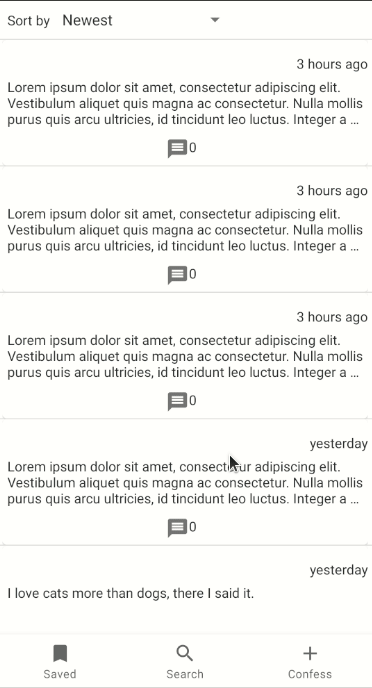
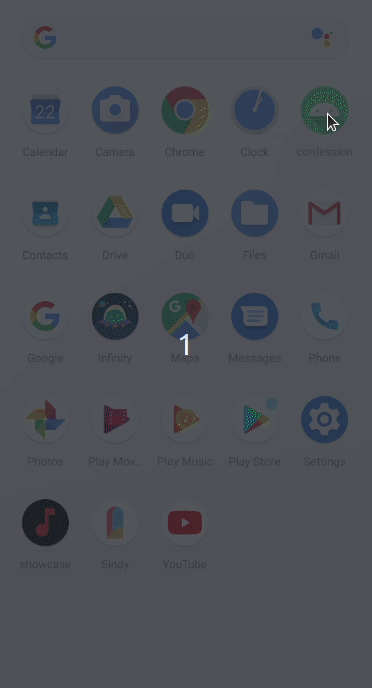
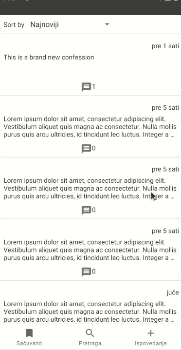
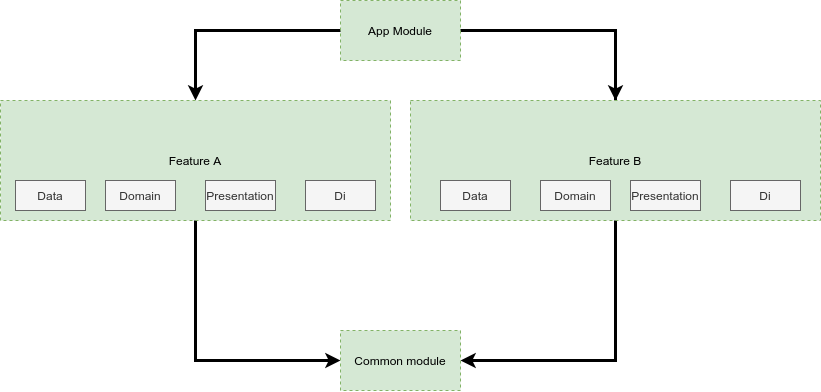
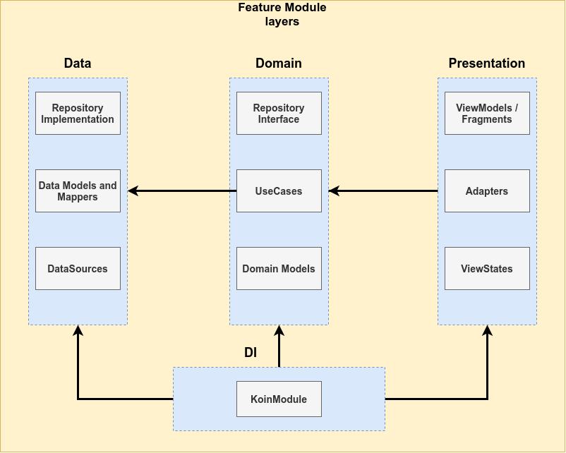

# Confession App
An Android application to share and comment on others confessions. Comes together with a custom Nodejs server which can be found [here](https://github.com/Nikola-Milovic/Confession-Server).
This is another for fun project, featuring clean and organized architecture, where each layer is responsible for itself and coupling of layers within the application is kept down to a minimum.

# App showcase

### Main app screen

### Error screen

### Empty feed

### Localized to Serbian

# Architecture

Each feature, a logical unit, is placed within a module, meaning that all of the logic for a single screen (usually) is inside a single module. This way of architecturing our app gives us, at least these 3 benefits: 

* Clear isolation between the modules. The whole goal of the MVP pattern is to make sure your business logic and presentations layer are not tightly coupled together. By defining these in different modules it makes this separation more clear and further emphasises decoupling between non-related logic.
* Code reuse - allows us to have a common module, or a core module that our other modules can implement. The code inside that module can be reused throught the application and features. In our case, we have a Common module and Library test utils. Both featuring multiple useful files and util functions.
* Splitting your project into sub-project allows more efficient build and testing as you can rebuild and test only the modules that changed rather than recompiling the whole project whenever there's a change in one of the files. In a production environment it also allows programmers to work on different parts of the application without interfering with the work of others.

## Modules

The application is made in a mix of MVP, and MVI/MVVM for the presentation layer. 

We have three kinds of modules in the application:

* app module - this is the main module. It contains code that lays foundation for other modules, it starts Koin and loads the KoinModules used throughout the application, it also features NavHostFragment and NavManager.
* application-independent Common module containing common code base that could be reused throughout the application and other Modules. It holds util functions and other useful helper classes. And Library-test-utils that holds useful utils needed for easier testing.
* feature modules - the most common type of module containing all code related to a given feature. Basically a logic unit, where all of the logic for that given functionality is packed together in a single Module. Common examples could be LoginModule, HomepageModule...

### Structure of feature modules

Each feature should be responsible for itself, meaning it should be as decoupled as possible. That is firstly achieved by spliting them up in different modules, then each feature module is consisting of DATA, DOMAIN, PRESENTATION and DI layers

#### Presentation layer

This layer is closest to what the user sees on the screen. The `presentation` layer is a mix of `MVVM` (Jetpack `ViewModel` used to preserve data across activity restart) and
`MVI` (`actions` modify the `common state` of the view and then new state is edited to a view via `LiveData` to be rendered).
Fragments are connected to the layouts and views with the help of [ViewBinding](https://developer.android.com/topic/libraries/view-binding), a more lightweight DataBinding with less capability but faster compile time.

> `common state` (for each view) approach derives from
> [Unidirectional Data Flow](https://en.wikipedia.org/wiki/Unidirectional_Data_Flow_(computer_science)) and [Redux
58
> principles](https://redux.js.org/introduction/three-principles).

Components:
- **View (Fragment)** - presents data on the screen and pass user interactions to View Model. Views are hard to test, so they should be as simple as possible.
- **ViewModel** - dispatches (through `LiveData`) state changes to the view and deals with user interactions (these view models are not simply [POJO classes](https://en.wikipedia.org/wiki/Plain_old_Java_object)).
- **ViewState** - common state for a single view
- **NavManager** - singleton that facilitates handling all navigation events inside `NavHostActivity` (instead of separately, inside each view)

#### Domain layer

This is the core layer of the application. Notice that the `domain` layer is independent of any other layers. This allows to make domain models and business logic independent from other layers.
In other words, changes in other layers will have no effect on `domain` layer eg. changing database (`data` layer) or screen UI (`presentation` layer) ideally will not result in any code change withing `domain` layer.

Components:
- **UseCase** - contains business logic
- **DomainModel** - defies the core structure of the data that will be used within the application. This is the source of truth for application data.
- **Repository interface** - required to keep the `domain` layer independent from the `data layer` ([Dependency inversion](https://en.wikipedia.org/wiki/Dependency_inversion_principle)).

#### Data layer

Manages application data and exposes these data sources as repositories to the `domain` layer. Typical responsibilities of this layer would be to retrieve data from the internet and optionally cache this data locally.

Components:
- **Repository** is exposing data to the `domain` layer. Depending on application structure and quality of the external APIs repository can also merge, filter, and transform the data. The intention of
these operations is to create high-quality data source for the `domain` layer, not to perform any business logic (`domain` layer `use case` responsibility).

- **Mapper** - maps `data model` to `domain model` (to keep `domain` layer independent from the `data` layer).
- **RetrofitService** - defines a set of API endpoints.

### DI layer

Manages dependancies for the given module. It connects all of the different layers of the application. It is consisting of a single KoinModule that gets loaded on Fragments attachment and unloaded onDetach. It provides Usecases to the ViewModel, Repository to the Usecases, Services to the Repository and so on...

# Libraries Used

* [Foundation][0] - Components for core system capabilities, Kotlin extensions and support for
  multidex and automated testing.
  * [AppCompat][1] - Degrade gracefully on older versions of Android.
  * [Android KTX][2] - Write more concise, idiomatic Kotlin code.
  * [Test][4] - An Android testing framework for unit and runtime UI tests.
* [Architecture][10] - A collection of libraries that help design robust, testable, and
  maintainable apps.
  * Clean Architecture (at module level)
  * MVVM + MVI (presentation layer)
  * [Data Binding][11] - Declaratively bind observable data to UI elements.
  * [Koin][100] - A pragmatic lightweight dependency injection framework for Kotlin developers.
  * [Lifecycles][12] - Create a UI that automatically responds to lifecycle events.
  * [LiveData][13] - Build data objects that notify views when the underlying database changes.
  * [Navigation][14] - Handle everything needed for in-app navigation.
  * [ViewModel][17] - Store UI-related data that isn't destroyed on app rotations. Easily schedule
     asynchronous tasks for optimal execution.
* [UI][30] - Details on why and how to use UI Components in your apps - together or separate
  * [Material][32] - Material Components for Android is a drop-in replacement for Android's Design Support Library.
  * [Fragment][34] - A basic unit of composable UI.
  * [Layout][35] - Layout widgets using different algorithms.
  * [RefreshLayout][93] - Layout with swipe to refresh functionality
  * [Lottie][99] - Lottie is a mobile library for Android and iOS that parses Adobe After Effects animations and renders them natively on mobile
* Gradle
  * [Gradle Kotlin DSL](https://docs.gradle.org/current/userguide/kotlin_dsl.html)
  * BuildSrc
* Third party
  * [Kotlin Coroutines][91] - Managing background threads with simplified code and reducing needs for callbacks
  * [Timber][92] - Logger with a small, extensible API which provides utility on top of Android's normal Log class.
  * [Retrofit][94] - A type-safe HTTP client for Android and Java
  

[0]: https://developer.android.com/jetpack/components
[1]: https://developer.android.com/topic/libraries/support-library/packages#v7-appcompat
[2]: https://developer.android.com/kotlin/ktx
[4]: https://developer.android.com/training/testing/
[10]: https://developer.android.com/jetpack/arch/
[11]: https://developer.android.com/topic/libraries/data-binding/
[12]: https://developer.android.com/topic/libraries/architecture/lifecycl
[13]: https://developer.android.com/topic/libraries/architecture/livedata
[14]: https://developer.android.com/topic/libraries/architecture/navigation/
[17]: https://developer.android.com/topic/libraries/architecture/viewmodel
[30]: https://developer.android.com/guide/topics/ui
[32]: https://github.com/material-components/material-components-android
[34]: https://developer.android.com/guide/components/fragments
[35]: https://developer.android.com/guide/topics/ui/declaring-layout
[91]: https://kotlinlang.org/docs/reference/coroutines-overview.html
[92]: https://github.com/JakeWharton/timber
[93]: https://developer.android.com/training/swipe/add-swipe-interface
[94]: https://square.github.io/retrofit/
[99]: https://github.com/airbnb/lottie-android
[100]: https://github.com/InsertKoinIO/koin

### LottieAnimations used in the application

[Attention by Houssem Ismail](https://lottiefiles.com/32338-attention)

[Spaceship by Arman Rokni](https://lottiefiles.com/4011-spaceship-empty-searching)

[Construction in progress by Ki8.net](https://lottiefiles.com/26531-construction-in-process)

### Acknowledgements

[Android showcase by Igorwojda](https://github.com/igorwojda/android-showcase)

[Android Sunflower app](https://github.com/android/sunflower)

[Android architecture samples](https://github.com/android/architecture-samples)

